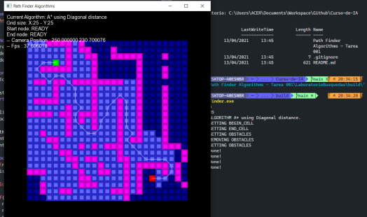
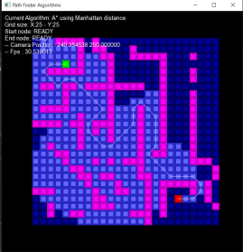
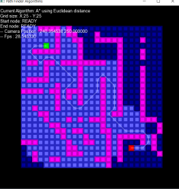
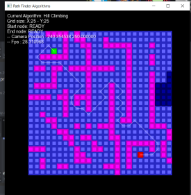
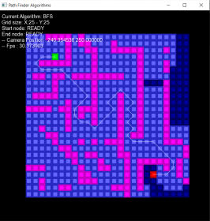
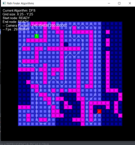

# **Algoritmos de Búsqueda de Caminos (A\*, BFS, DFS)**

## Última fecha de modificación: 03/04/2021

Programa interactivo que permite visualizar los algoritmos de búsqueda de caminos A*, BFS y DFS.

## Integrantes que participaron:

- Luis Alexin Salazar Marroquin
- Yhon Yerson Sanchez Yucra
- Italo Mamani Huaricallo
- Rodrigo Andre Cayro Cuadros

## Requerimientos:
- SFML 2.5.1 instalado

## Instalación:
- `cd LaboratorioBusquedas`
- `mkdir build`
- `cmake -G <Generador> -B "build"`
- `cd build`

## Ejecución:
- `./PathFinder`

## Controles:
- Ver el archivo Settings.h de la carpeta LaboratorioBusquedas/include
- Las teclas disponibles están marcadas por los comentarios `//Keys ...` y `//----`
 # 1 heuristic search
##  A* using Diagonal distance

## A* using Diagonal distance Manhattan

## A* using Euclidean distance

## Algorithm Hill Climbing

# 2 blind search 
## Algorithm DFS

## Algorithm BFS
