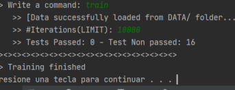
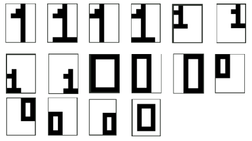
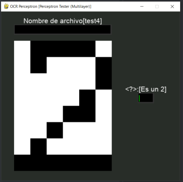
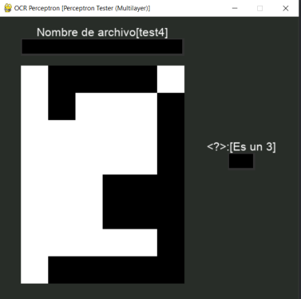

# **Perceptron simple y multicapa ("O"CR) para reconocer digitos**

## Última fecha de modificación: 29/05/2021

Programa interactivo dividido en 3 subprogramas que permiten crear datos de entrenamiento, 
entrenar a una red neuronal y testing de una red neuronal para el reconocimiento de dígitos como vectores de bits.

## Integrantes que participaron:

- Luis Alexin Salazar Marroquin
- Yhon Yerson Sanchez Yucra
- Italo Mamani Huaricallo
- Rodrigo Andre Cayro Cuadros

## Requerimientos:
- numpy 1.19.5
- pygame 2.0.1
- progress 1.5

## Ejecución:
- `cd App`
- ### Ejecucion del creador de datos de entrenamiento
- `python dataset_creator.py`
- ### Ejecucion del trainer
- `python trainer.py`
- ### Ejecucion del tester
- `python tester.py`

## Dataset

## Testing

